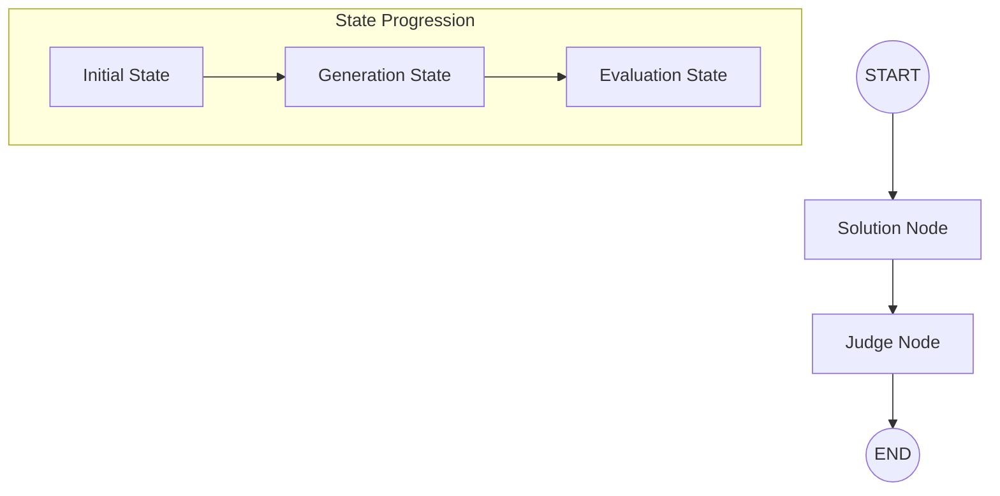

# ⚡ AI BATTLE ARENA


**AI Battle Arena** is a high-stakes, gamified arena where Large Language Models (LLMs) compete in a battle of wits. When you submit a prompt, the arena initiates the **Strike Protocol**, pitting two top-tier models against each other to see who can provide the most optimized, creative, or accurate solution.

---

## ⚔️ The Fighters & The Judge

The arena uses a specialized orchestration engine to manage three distinct AI personalities:

- **Fighter A (MistralAI)**: Powered by `mistral-medium-latest`. Known for its concise and logical reasoning.
- **Fighter B (Cohere)**: Powered by `command-r-03-2025`. Optimized for complex tasks and deep context understanding.
- **The Judge (Google Gemini)**: Powered by `gemini-1.5-flash`. A neutral, superior arbiter that evaluates both solutions and declares a winner.

---

## 🧠 Why LangGraph?

We use **LangGraph** to manage the "Battle Logic" as a stateful, cyclical graph. Unlike simple linear chains, LangGraph allows us to define the battle as a series of coordinated steps (Nodes) that share and mutate a single **State Object**. This ensures that the Judge has full access to the prompt and both solutions before making a final decision.

### The Battle Workflow (LangGraph Diagram)



### 📊 How the State Evolves
1.  **START NODE**: The graph initializes with your problem.
    *   *State:* `{ problem: "Write a React hook..." }`
2.  **SOLUTION NODE**: Mistral and Cohere generate their responses in parallel.
    *   *State:* `{ problem, solution_1: "...", solution_2: "..." }`
3.  **JUDGE NODE**: Gemini analyzes both solutions, assigns scores (0-10), and provides reasoning.
    *   *State:* `{ problem, solution_1, solution_2, judge: { solution_1_score, solution_2_score, reasoning } }`
4.  **END NODE**: The final state is returned to the UI to trigger the victory animations.

---

## 🛠️ Local Installation Guide

Want to run the arena on your own machine? Follow these steps:

### 1. Clone & Install
```bash
git clone https://github.com/Akshvt/AI-Battle-Arena.git
cd AI-Battle-Arena

# Install Backend
cd Backend && npm install

# Install Frontend
cd ../Frontend && npm install
```

### 2. Environment Configuration
Create a `.env` file inside the `Backend/` directory:

```env
# AI Models
MISTRAL_API_KEY=your_mistral_key
COHERE_API_KEY=your_cohere_key
GOOGLE_GENERATIVE_AI_API_KEY=your_gemini_key

# Server
PORT=3001
NODE_ENV=development
```

### 3. Start the Engines
Open two terminals:
- **Terminal 1 (Backend):** `cd Backend && npm run dev`
- **Terminal 2 (Frontend):** `cd Frontend && npm run dev`

---

## 🚀 Deployment
- **Backend**: Deployed on **Render** (Root: `Backend`, Build: `npm install && npm run build`, Start: `npm start`).
- **Frontend**: Deployed on **Vercel** (Root: `Frontend`, Output: `dist`).

---

**Made with ⚡ by [Akshat](https://github.com/Akshvt)**


